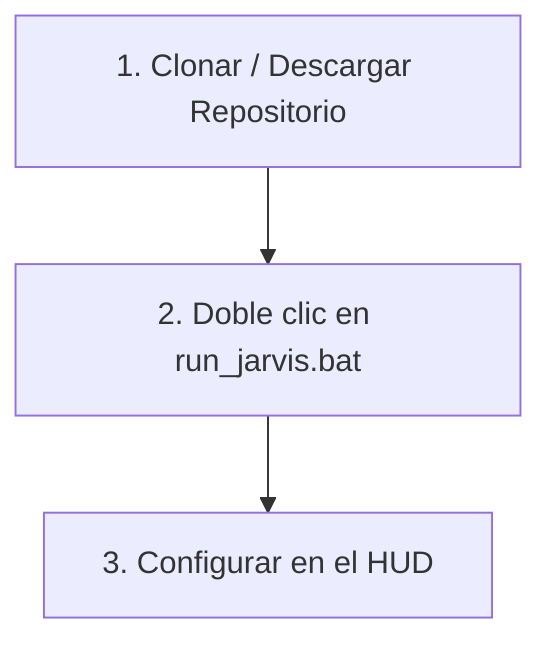

# 🖥️ J.A.R.V.I.S — Just A Rather Very Intelligent System

<p align="center">
  
  
  
</p>

---

## 🌌 Visión General

**J.A.R.V.I.S** es un asistente de voz híbrido de alto rendimiento diseñado exclusivamente para **Windows**. Cuenta con una interfaz **HUD holográfica al estilo Iron Man** (construida sobre `pywebview`), telemetría de hardware en tiempo real (CPU, RAM y GPU NVIDIA), memoria semántica persistente y un control total de comandos del sistema. 

El asistente es **híbrido y dinámico**: puedes cambiar en caliente desde su panel de configuración entre procesamiento en la nube (**Claude** / **Gemini**) y procesamiento local 100% offline (**Ollama**).

---

## ✨ Características Destacadas

| Característica | Descripción |
| :--- | :--- |
| **🎙️ VAD Inteligente** | Grabación de voz asíncrona optimizada. Corta automáticamente tras 1.5s de silencio o a los 5s de límite. |
| **🤖 Selector de LLM en Caliente** | Cambia al instante entre **Claude API**, **Gemini API** y **Ollama local** directamente desde la interfaz gráfica. |
| **📊 Telemetría Real** | Monitoreo dinámico de CPU, RAM, Lectura/Escritura de red, Temperatura del procesador y **GPU NVIDIA** (`nvidia-smi`). |
| **🖼️ Visión Computacional** | Captura y analiza tu pantalla principal con inteligencia visual para responder dudas del contenido activo. |
| **🎵 Control de Ventanas y Medios** | Simula atajos físicos de Windows para acoplar ventanas, minimizar todo, y controlar reproductores (ej. Spotify). |
| **🧠 Memoria Semántica** | Base de datos SQLite local con embeddings deterministas para recordar contextos de charlas anteriores. |
| **🎛️ Preajustes de Pantalla** | Selector rápido de dimensiones de ventana (Chica, Mediana, Grande), pantalla completa o escala personalizada en caliente. |
| **🎹 Atajo de Teclado Global** | Activa el micrófono instantáneamente desde cualquier aplicación de Windows usando el atajo `Ctrl + Alt + J`. |
| **🔊 Efectos y Barras de Voz** | Efectos de sonido de ciencia ficción (sintetizados por Web Audio) y barras animadas que pulsan en tiempo real al hablar o escuchar. |
| **🏠 Asistente Offline Clima/Hora** | Modo offline inteligente con consultas de hora, fecha y clima (integrado con DuckDuckGo gratuito) sin usar API Keys. |
| **🔒 Filtro de Seguridad** | Protege tu terminal de comandos destructivos pidiendo confirmación de voz y texto antes de ejecutar acciones críticas. |

---

## 🚀 Instalación Rápida (100% Automatizada)

No necesitas escribir comandos largos en la consola ni configurar variables de entorno manualmente. Todo el ciclo de configuración se realiza de forma visual:



## Instalación y Arranque (En un solo clic)

Para tu comodidad, la instalación de dependencias y el encendido del sistema están unificados en un **único archivo ejecutable**:

1. **Doble clic en `run_jarvis.bat`**: 
   * La primera vez que lo ejecutes, detectará si te falta alguna librería de Python y la instalará automáticamente en segundo plano.
   * Iniciará Ollama si decides usar el modo local y no está activo.
   * Iniciará inmediatamente la consola de fondo y el HUD holográfico de Jarvis.
2. **Configurar en el HUD:** Ya no hace falta editar archivos de código. Una vez que el HUD inicie, haz clic en el botón **CONFIG (⚙)** abajo al centro, selecciona tu proveedor de IA (Demo, Claude, Gemini, Ollama), ingresa las claves si corresponden y dale a **GUARDAR**. Los ajustes persistirán para siempre.

---

## 🛠️ Configuración de los Proveedores de LLM

Puedes alternar entre cuatro potentes modos de inteligencia según tus necesidades:

| Proveedor / Modo | Tipo | Costo | Ventajas |
| :--- | :--- | :--- | :--- |
| **Modo Demo (Offline)** | Local (Reglas) | Gratis | **¡Por defecto!** Funciona al instante sin configurar claves ni cuentas. |
| **Ollama local** | Local (Modelo) | Gratis | 100% privado, funciona offline y tiene razonamiento inteligente local. |
| **Claude API** | Online (Nube) | Pago (Pay-as-you-go) | Inteligencia máxima, excelente control y razonamiento complejo. |
| **Gemini API** | Online (Nube) | Gratis (Free Tier) | Muy rápido, gran ventana de contexto y opción sin costo desde AI Studio. |

> [!NOTE]  
> **¿Cómo desactivar Ollama del arranque de Windows?**  
> Por defecto, Ollama se inicia al encender tu PC. Si no quieres que consuma recursos en segundo plano, haz clic derecho sobre su icono en la barra de tareas de Windows, desmarca **"Start on Startup"** (o desactívalo desde el Administrador de Tareas en "Inicio").  
> *¡No te preocupes!* El script `run_jarvis.bat` iniciará Ollama automáticamente en segundo plano **solo cuando uses a Jarvis** si detecta que no está corriendo.

---

## 📑 Tutorial: Obtención de API Keys (Paso a Paso)

<details>
<summary>🔑 Hacer clic aquí para ver cómo conseguir tu API Key de Claude (Anthropic)</summary>

1. Entra a la consola de desarrolladores de Anthropic: **[console.anthropic.com](https://console.anthropic.com/)**.
2. Regístrate o inicia sesión con tu cuenta.
3. Ve a la sección **"API Keys"** en el panel de navegación superior/lateral.
4. Haz clic en **"Create Key"** (Crear clave), asígnale un nombre (por ejemplo, `Jarvis-Local`) y confírmalo.
5. Copia la clave generada (comienza con `sk-ant-`) y pégala en el panel de **CONFIG (⚙)** de Jarvis.
</details>

<details>
<summary>🔑 Hacer clic aquí para ver cómo conseguir tu API Key de Gemini (Google) a Costo Cero</summary>

1. Entra a Google AI Studio: **[aistudio.google.com](https://aistudio.google.com/)**.
2. Inicia sesión utilizando tu cuenta de Google.
3. Haz clic en el botón **"Get API Key"** (Obtener API Key) en la parte superior izquierda de la pantalla.
4. Haz clic en **"Create API Key"** (Crear API Key) y asóciala a un proyecto nuevo.
5. Copia la clave generada (comienza con `AIzaSy`) y pégala en el panel de **CONFIG (⚙)** de Jarvis.
   > [!TIP]
   > Google AI Studio ofrece una cuota de uso gratuita (*Free Tier*) sumamente amplia para desarrollo personal, lo que te permite usar a Jarvis a coste cero y con excelente velocidad.
</details>

---

## 🎙️ Catálogo de Comandos Disponibles

Jarvis cuenta con **15 herramientas integradas** para controlar tu sistema. Aquí tienes ejemplos de frases naturales que puedes usar para activarlas:

### 1. Control de Aplicaciones y Navegación
* **Abrir programas:** `"Abrí Chrome"`, `"Iniciá Spotify"`, `"Abrí la calculadora"`, `"Ejecutá VS Code"`.
  > *Apps soportadas nativamente:* Chrome, Firefox, Notepad, Spotify, VS Code, Explorer (Carpetas), Terminal, Calculadora, Paint, Word, Excel, PowerPoint, Outlook, Teams, Discord, Steam, VLC.
* **Navegar en la web:** `"Abrí la página de Google"`, `"Navegá a github.com"`.
* **Escribir texto simulado:** `"Escribí 'Hola mundo' en la pantalla"`. (Simula la escritura letra por letra en la app activa).

### 2. Gestión de Ventanas (Atajos de Windows)
* **Minimizar todo:** `"Minimizá todas las ventanas"` o `"Mostrame el escritorio"`.
* **Cerrar ventana activa:** `"Cerrá esta ventana"` o `"Cerrá el programa actual"`.
* **Maximizar ventana:** `"Maximizá la ventana"`.
* **Acoplar / Dividir pantalla:** `"Acoplá a la izquierda"`, `"Acoplá la ventana a la derecha"`.

### 3. Control Multimedia (Spotify, YouTube, etc.)
* **Reproducción:** `"Pausá la música"`, `"Reproducí la canción"`.
* **Saltar canciones:** `"Siguiente canción"`, `"Pasá al siguiente tema"`, `"Canción anterior"`, `"Volvé a la canción anterior"`.

### 4. Control de Volumen
* **Volumen general:** `"Subí el volumen"`, `"Bajá el volumen"`.
* **Silenciar:** `"Silenciá el sistema"`, `"Desactivá el silencio"`.
* **Porcentaje específico:** `"Poné el volumen al 30%"`, `"Establecé el volumen en 50"`.

### 5. Captura y Visión IA (Análisis de Pantalla)
* **Sacar captura:** `"Sacá una captura de pantalla"`, `"Tomá una foto de la pantalla"`.
* **Analizar captura:** `"Sacá una captura y decime qué ves"`.
* **Analizar pantalla directamente:** `"¿Qué tengo abierto en la pantalla?"`, `"Leé el código que tengo en pantalla"`.

### 6. Información del Sistema y Telemetría
* **Consumo general:** `"¿Cómo están los recursos del sistema?"`, `"Estado del sistema"`.
* **Consumo individual:** `"¿Cuánto consume el CPU?"`, `"Temperatura de la GPU"`, `"Uso de memoria RAM"`, `"Espacio en disco"`, `"IP actual"`, `"¿Qué procesos están abiertos?"`.

### 7. Recordatorios y Alarmas
* **Crear recordatorios:** `"Recordame sacar la basura en 20 minutos"`, `"Avisame que apague el horno en 5 minutos"`.
* **Recordatorios recurrentes:** `"Recordame tomar agua cada hora (o cada 3600 segundos)"`.
* **Listar/Cancelar:** `"¿Qué recordatorios tengo activos?"`, `"Cancelá el recordatorio número 1"`.

### 8. Memoria Semántica (Recuerdos)
* **Guardar datos:** `"Recordá que mi perro se llama Toby"`, `"Guardá en tu memoria que mi color favorito es el azul"`.
* **Recuperar recuerdos:** `"¿Cómo se llama mi perro?"`, `"¿Qué te dije sobre mi color favorito?"`.

### 9. Búsqueda Web y Consola Segura
* **Búsqueda web:** `"Buscá en internet quién ganó el partido ayer"`, `"¿Qué tiempo hace hoy?"`.
* **Ejecutar comandos en la consola:** `"Ejecutá el comando ipconfig"`, `"Creá una carpeta llamada Test usando cmd"`.
  > [!WARNING]  
  > **Filtro de seguridad de comandos:** Si le pides a Jarvis ejecutar un comando potencialmente peligroso (como `del`, `rm`, `format`, `shutdown`, `reg`, etc.), el sistema te advertirá por voz y te pedirá confirmación manual escribiendo `si` en la consola antes de proceder.

---

## 📂 Estructura del Proyecto

<details>
<summary>📂 Hacer clic aquí para desplegar la estructura del código y archivos</summary>

```
jarvis/
├── main.py              ← Punto de entrada principal y bucle asíncrono
├── config.py            ← Configuraciones y cargador persistente config_user.json
├── run_jarvis.bat       ← Lanzador único unificado (autoinstala y arranca el sistema)
├── requirements.txt     ← Dependencias del sistema necesarias
├── modules/
│   ├── brain.py         ← Orquestador, Tool Calling y enrutamiento (Claude/Gemini/Ollama)
│   ├── listener.py      ← Activación por voz (Porcupine/Enter) + VSTT Whisper
│   ├── speaker.py       ← Voz sintetizada (pyttsx3/ElevenLabs)
│   ├── system.py        ← Controles de Windows, volumen, atajos y teclas multimedia
│   ├── search.py        ← Búsqueda en la web (DuckDuckGo API)
│   └── reminders.py     ← Hilo de recordatorios y parser NLP de alarmas
├── memory/
│   ├── manager.py       ← Base de datos SQLite, embeddings L2 y preferencias
│   ├── config_user.json ← Ajustes persistentes de la sesión (se crea solo)
│   └── semantic.db      ← Base de datos relacional de memoria (se crea solo)
└── ui/
    ├── hud.py           ← Inicializador de ventana pywebview y puente JS/Python
    └── hud.html         ← Interfaz estilo HUD Iron Man con telemetría en tiempo real
```
</details>

---

## 🎙️ Wake Word Personalizado (Opcional)

Por defecto, puedes presionar **Enter** en la consola para activar el micrófono manualmente en cualquier momento. Sin embargo, para usar el comando de voz de activación activa:

1. Regístrate gratis en **[console.picovoice.ai](https://console.picovoice.ai)**.
2. Descarga el archivo de modelo "Jarvis" para Windows (`.ppn`) y guárdalo en la carpeta `wake_word/jarvis_windows.ppn`.
3. Copia tu clave API de Picovoice y pégala como `PICOVOICE_API_KEY` en la configuración del HUD de Jarvis.
